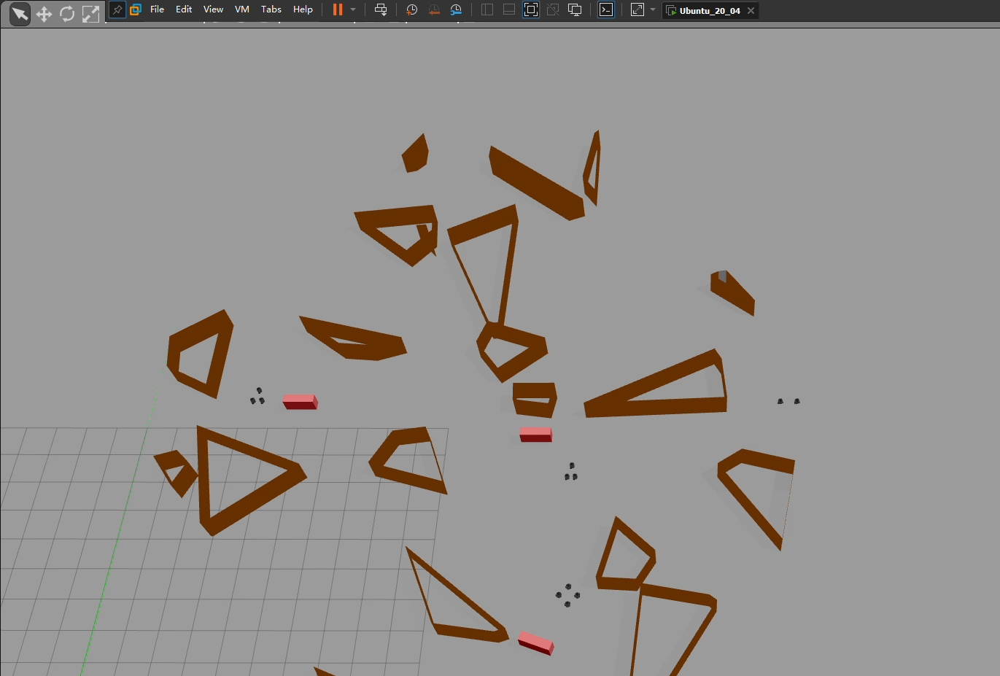

# Multi-Formation Planning and Coordination for Object Transportation #
### **Accepted for publication in 11th European Conference on Mobile Robots (ECMR 2023)**
### Project Description
This repository contains the supplementary document and the source code for the work.
### 
<!--[](https://www.bilibili.com/video/BV1sP41167F8/?spm_id_from=333.999.0.0)) -->
[](https://www.bilibili.com/video/BV1sP41167F8/?spm_id_from=333.999.0.0)

This project is divided into the following tasks:
1.  Select a valid point in the map of randomly generated obstacles and generates the corresponding convex obstruction-free region.

2.  Global path planning and trajectory optimization.

3. Multi-robot task allocation.

4. Cooperative object handling and formation holding.

### Code Requirements and Dependencies
1. MATLAB2017b or later

2. Matlab built-in Toolbox: `Parallel Computing`, `Optimization`, `PID Tuner`.

3. [MOSEK/9.0](https://github.com/star2dust/MOSEK-MATLAB)

4. [Robotics Toolbox](https://github.com/star2dust/Robotics-Toolbox)

5. [CVX](https://github.com/cvxr/CVX)

### Running the Code
Before running the code, add the subfunction and data files to the working path: right-click `data`, `plot`, `global_path_planning`, `motion_planning`, `task_allocation`, `trajectory_optimization`, `test` folder and select "Add to Path" and then select "Selected Folders and Subfolders ".

- Modify the following different iteration conditions (comment out one of the two lines of code for  `Global_planning.m` in the `global_path_planning` folder) to the first feasible or globally optimal trajectory, and the corresponding optimized trajectory:

```matlab
while isempty(noderoute)
while length(find(cell_dis_total==-Inf)) < size(cell_x,1)*size(cell_x,2)*0.9
```

run `global_planning_test.m` in the test folder to visualize the optimized trajectory.
This may take some time to complete, depending on the performance of the computer. It takes several minutes to find the globally optimal path.

- run `Computing_LargeConvexRegions.m` in the test folder to show the process of convex region generation and output the hyperparameters of the separated hyperplane in the command window.

- run `motion_plannning_ta_test.m` in the test folder to visualizes the process of multi-robot task allocation and formation.

- run `motion_planning_fh_test.m` in the test folder to display animation: Multiple robots maintain formation and follow a global path to move objects.

- run `Project_Presentation.m` in the test folder to show multi-robot task scheduling, 3 robots form formation, hold formation, and work together.

### Citation

If you find this work useful, please cite [	Multi-Formation Planning and Coordination for Object Transportation](https://scholar.google.co.uk/scholar?hl=zh-CN&as_sdt=0%2C5&as_vis=1&q=multi-formation+planning+and+coordination+for+object+transportation&btnG=) ([pdf](http://pure-oai.bham.ac.uk/ws/portalfiles/portal/199111934/paper_1158.pdf), [video](https://www.bilibili.com/video/BV1sP41167F8/?spm_id_from=333.999.0.0)):

```bibtex
@inproceedings{zhang2023multi,
  title={Multi-Formation Planning and Coordination for Object Transportation},
  author={Zhang, Weijian and Street, Charlie and Mansouri, Masoumeh},
  booktitle={European Conference on Mobile Robots (ECMR23)},
  year={2023},
  organization={IEEE}
}
```
